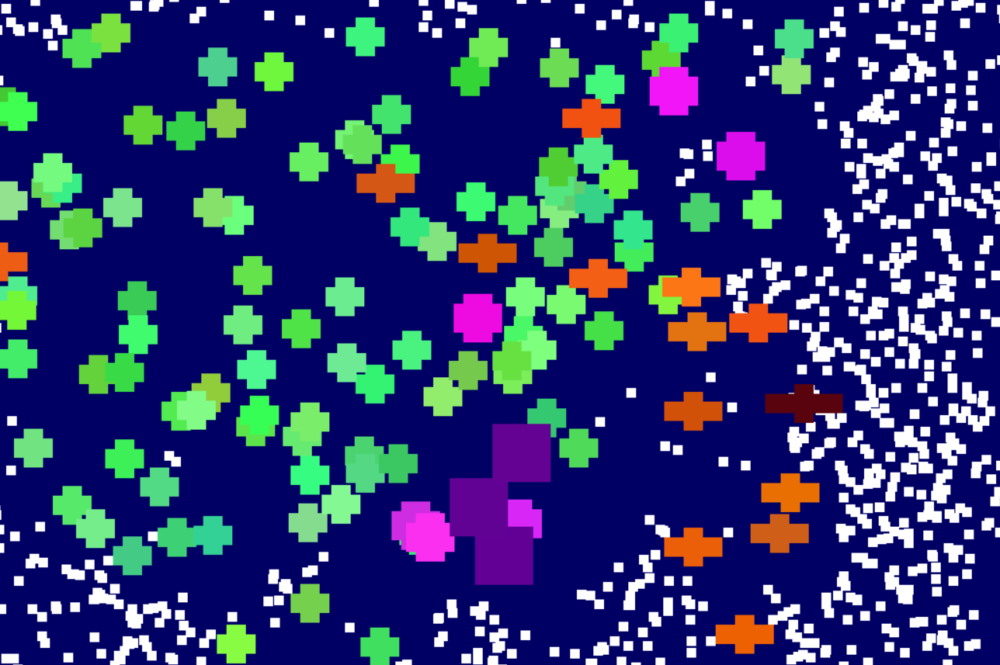
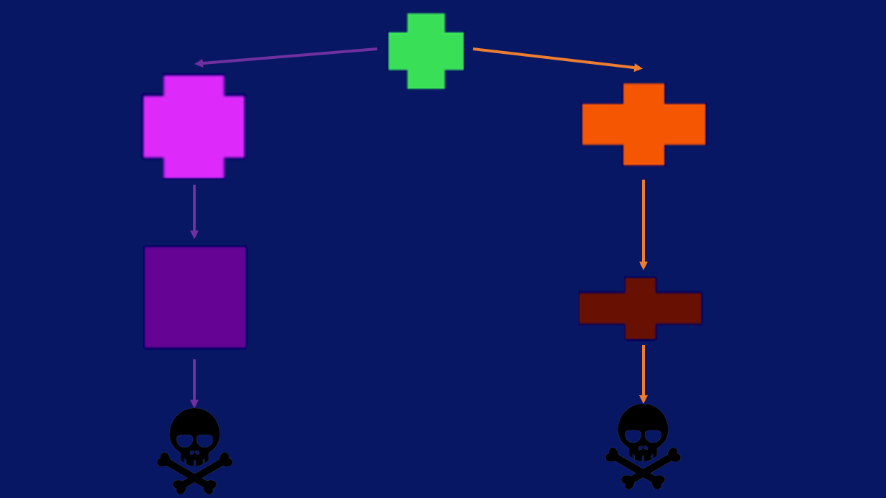

<!-- PROJECT LOGO -->
 

  <h3 align="center">PrimordialSoup</h3>

  

   A  simplified natural selection simulator using python
     
    <a href="https://github.com/MarcosSaade/PrimordialSoup/issues">Report Bug</a>
    ·
    <a href="https://github.com/MarcosSaade/PrimordialSoup">Request Feature</a>
  

<!-- TABLE OF CONTENTS -->

  
Table of Contents

  <ol>
    <li>
      <a href="#about-the-project">About The Project</a>
    </li>
    <li>
      <a href="#installation">Installation</a>
    </li>
    <li>
      <a href="#gene-pool">Gene Pool</a>
    </li>
  </ol>

<!-- ABOUT THE PROJECT -->
## About The Project

Simulates the non random survival of simple organisms over time.

(<a href="#readme-top">back to top</a>)

## Installation

This is not yet production ready. However, you can test it by executing the code of main.py on an environment with pygame installed.

## Gene Pool

The image below shows the gene pool and posible mutations
 

## Organisms

### Single Cell

* The simplest organism.
* Can form on its own.
* Mutates into: Big or Long (50/50)
* Food for reproduction: 12
* Speed: 1

### Long

* Comes from Single Cell
* Mutates into: Carnivore
* Food for reproduction: 16
* Speed: 2

### Carnivore

* Comes from Long
* Food for reproduction: 20
* Doesn't eat normal food, eats other organisms
* Can only eat after digesting previous food
* Can die of hunger
* Some chance of having lethal mutation
* Speed: 2

### Big

* Comes from Single Cell
* Mutates into: Sponge
* Food for reproduction: 21
* Speed: 0.5

### Sponge

* Comes from Big
* Food for reproduction: 36
* Can't move, remains static
* Can't be eaten by carnivores
* Some chance of having lethal mutation

(<a href="#readme-top">back to top</a>)

